
[![Contributors][contributors-shield]][contributors-url]
[![Issues][issues-shield]][issues-url]
[![LinkedIn][linkedin-shield]][linkedin-url]

# brazilian-e-commerce-eda

<!-- PROJECT LOGO -->
 

<h3 align="center">Brazilian E-Commerce Public Dataset EDA</h3>
  

    This flask api is tiny part of a whole system implementing data-warehouse.
     
     
     
    <a href="mailto:umairqadir97@gmail.com">Request Demo</a>
    ·
    <a href="https://github.com/umairqadir97/brazilian-e-commerce-eda/issues">Report Bug</a>
    ·
    <a href="https://github.com/umairqadir97/brazilian-e-commerce-eda/issues">Request Feature</a>
  

<a href="#">
    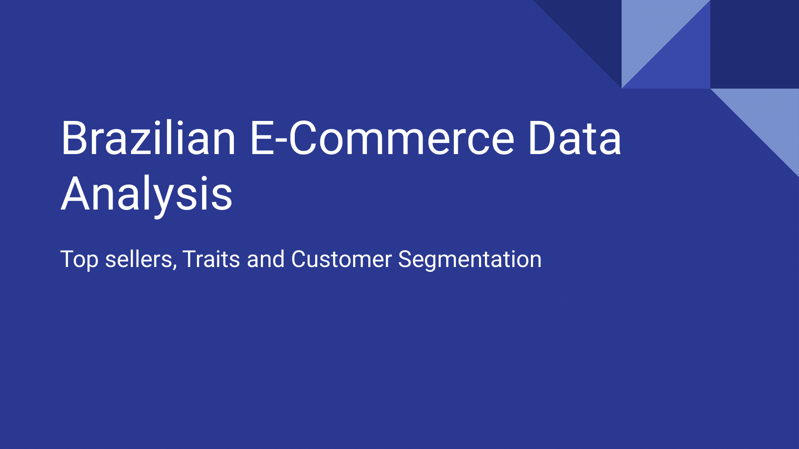
</a>

<a href="#">
    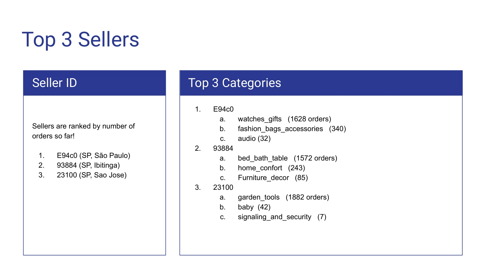
</a>

<a href="#">
    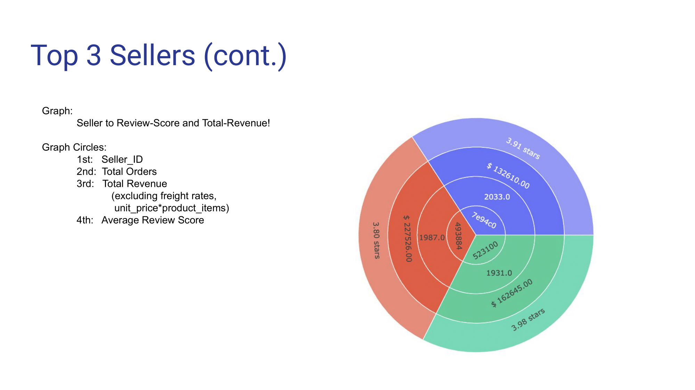
</a>

<a href="#">
    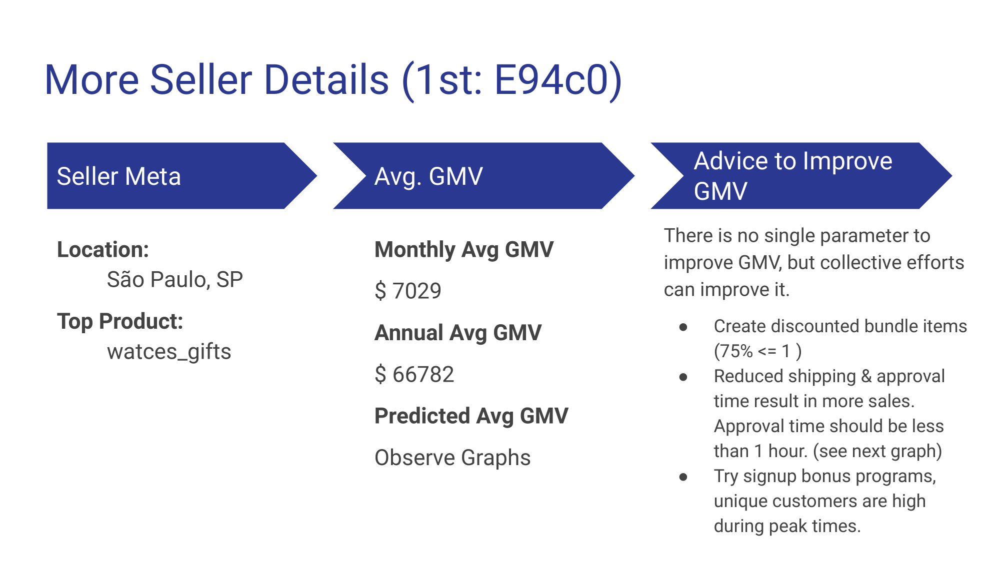
</a>

<a href="#">
    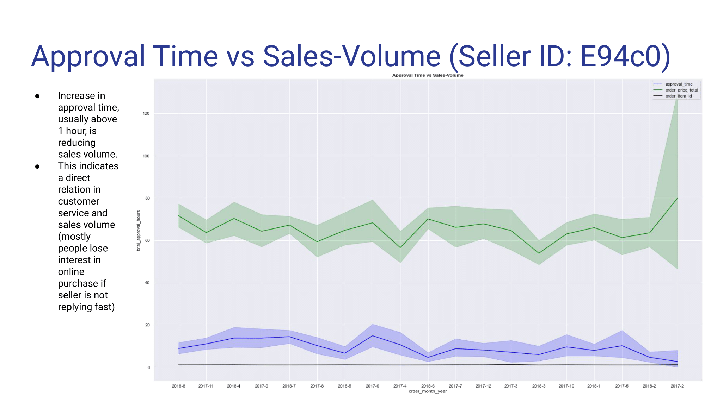
</a>

<a href="#">
    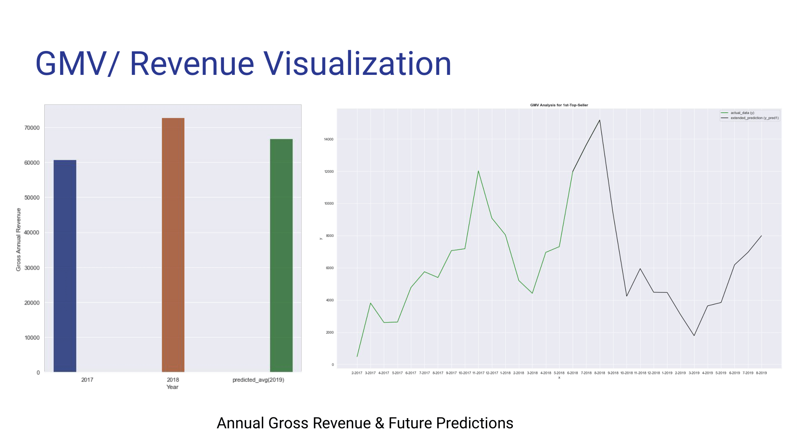
</a>

<a href="#">
    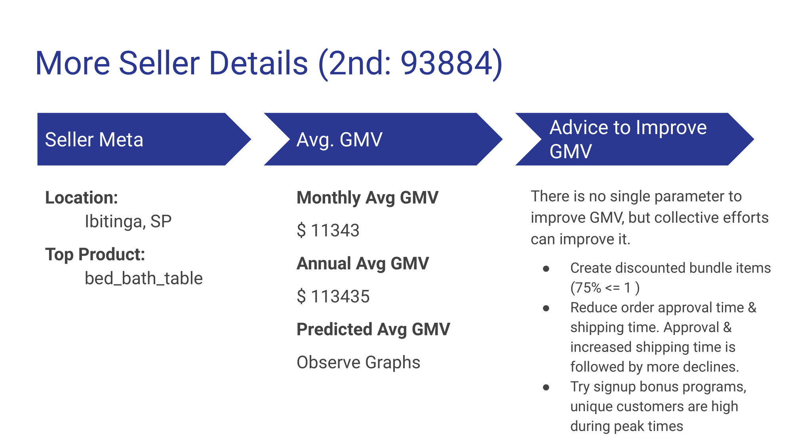
</a>

<a href="#">
    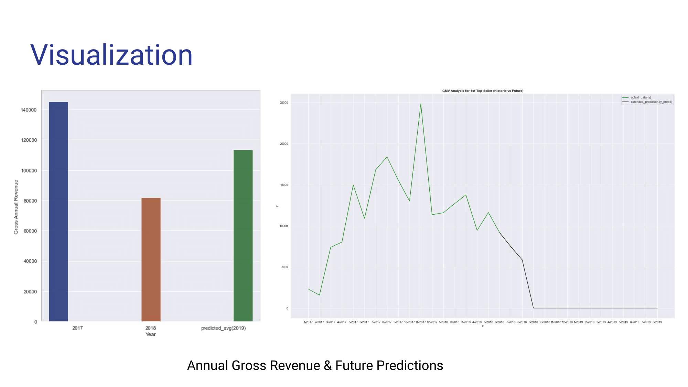
</a>

<a href="#">
    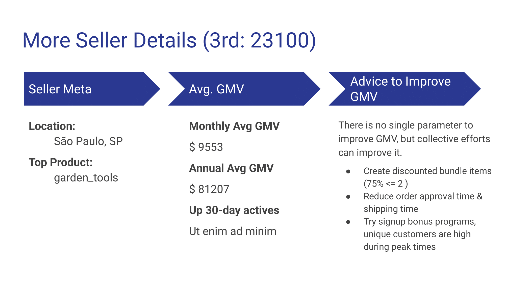
</a>

<a href="#">
    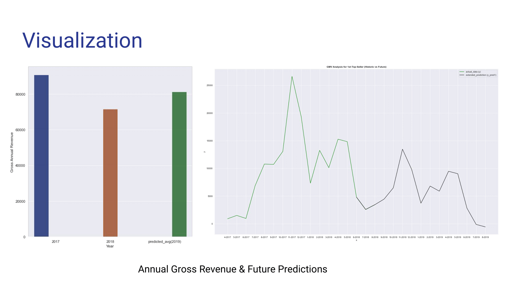
</a>

<a href="#">
    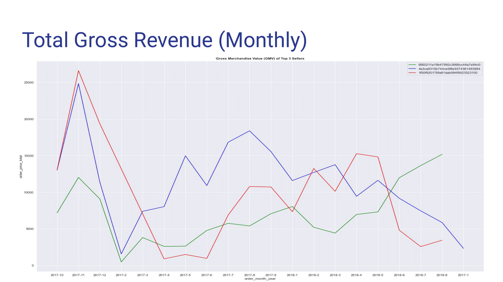
</a>

<a href="#">
    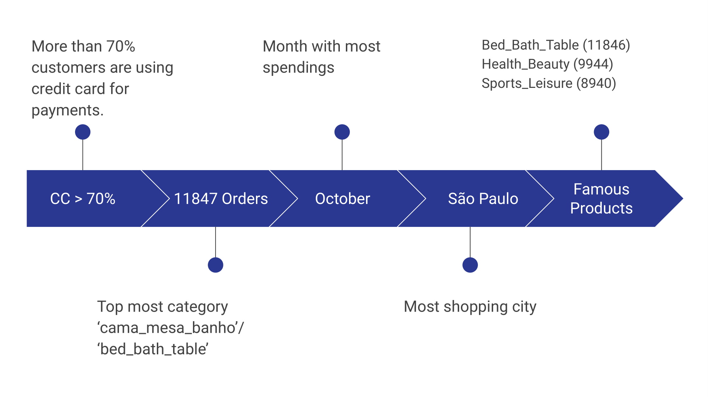
</a>

<a href="#">
    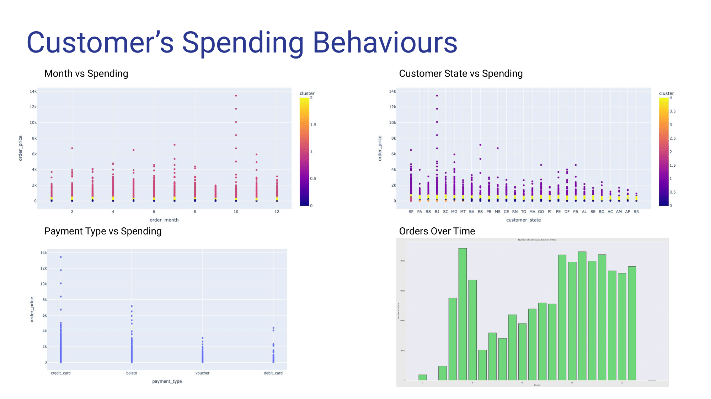
</a>

<!-- MARKDOWN LINKS & IMAGES -->

<!-- Contributors -->
[contributors-shield]: https://img.shields.io/github/contributors/othneildrew/Best-README-Template.svg?style=flat-square
[contributors-url]: https://github.com/umairqadir97/brazilian-e-commerce-eda/graphs/contributors

<!-- Issues -->
[issues-shield]: https://img.shields.io/github/issues/othneildrew/Best-README-Template.svg?style=flat-square
[issues-url]: https://github.com/umairqadir97/brazilian-e-commerce-eda/issues

<!-- LinkedIn -->
[linkedin-shield]: https://img.shields.io/badge/-LinkedIn-black.svg?style=flat-square&logo=linkedin&colorB=555
[linkedin-url]: https://linkedin.com/in/umairqadir

